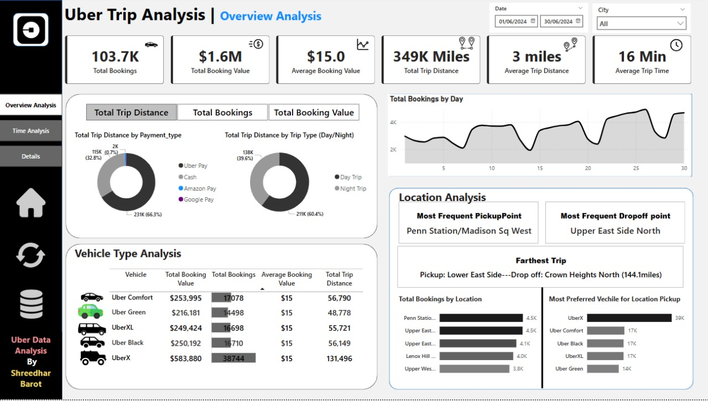
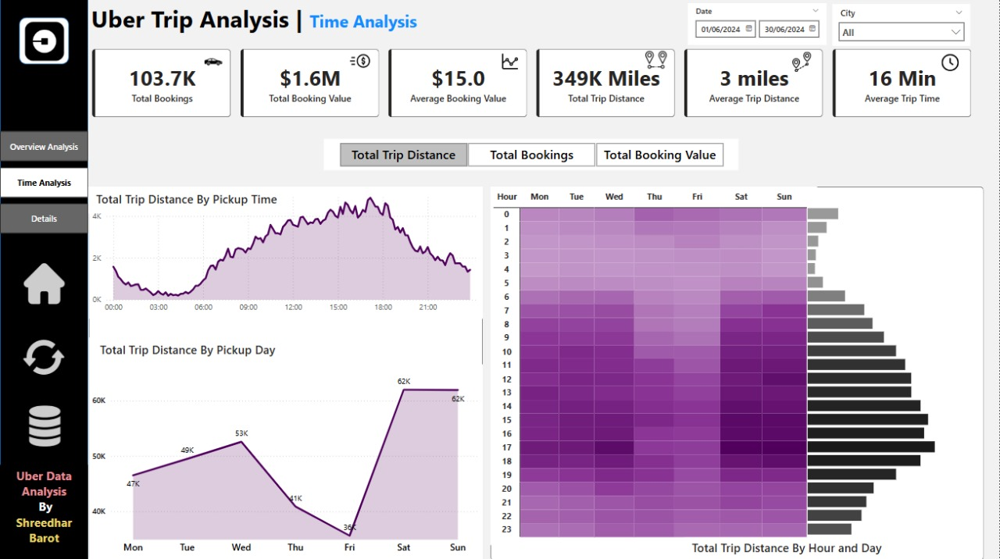

# 🚖 Uber Data Analysis Dashboard

## 📊 Overview
This Power BI dashboard provides a comprehensive analysis of Uber ride data, offering insights into ride patterns, peak hours, revenue trends, and trip distributions. The goal is to help stakeholders make data-driven decisions by understanding key business metrics.

## ✨ Features

✅ **Ride Distribution by Time and Location** 🕐  
✅ **Peak Hour and Peak Day Analysis** 📆  
✅ **Revenue Insights and Trend Analysis** 📊  
✅ **Top Earning Locations and Routes** 📍  
✅ **Trip Duration and Distance Analysis** 🛣️  
✅ **Vehicle Type and Payment Method Analysis** 🚗💳  
✅ **Interactive Dashboards with Dynamic Filters** 💡  

## 🚀 Live Demo
🔗 [**Live Dashboard**](https://app.powerbi.com/reportEmbed?reportId=bbb4930d-bb93-49e1-9c9a-964535a8a43e&autoAuth=true&ctid=d1f14348-f1b5-4a09-ac99-7ebf213cbc81)

## 💂 Dataset Information
The dataset includes trip details such as:
- **Trip ID, Pickup Date, and Time**
- **Vehicle Type and Payment Method**
- **Number of Passengers and Trip Distance**
- **Booking Value and Location Data**

## 🛠 Installation & Setup

### 🔽 Download & Open the Project
1. Download the Power BI file directly from the repository:  
   - 📥 **[Uber Project.pbix](Uber%20project.pbix)**  
2. Open it in **Power BI Desktop** (Make sure you have it installed).
3. Use filters to analyze trends and ride distributions.
4. Customize visualizations based on your requirements.

## 📷 Screenshots

### **Dashboard Overview**

### **Time Analysis**

### **Details Insights**

## 👨‍💼 Author
[Shreedhar Barot]

